# zuna-rs

**ZUNA EEG Foundation Model — fully Rust inference pipeline.**

`zuna-rs` ports the ZUNA masked-diffusion autoencoder
([Zyphra/ZUNA](https://huggingface.co/Zyphra/ZUNA)) entirely to Rust using the
[Burn ML framework](https://burn.dev/).  All three stages — FIF reading, EEG
preprocessing, and model inference — run without Python or PyTorch.

```
.fif file
   │
   ▼  exg (pure-Rust FIF reader + EEG pipeline)
   │  open_raw()          — native FIF reader (46× faster than MNE)
   │  resample()          — FFT resampler (MNE-compatible)
   │  highpass FIR        — zero-phase firwin (MNE-compatible)
   │  average reference
   │  global z-score → ÷ data_norm
   │  epoch (5 s @ 256 Hz)
   │
   ▼  ZUNA model (Burn / NdArray or wgpu)
   │  EncoderTransformer  (16 × TransformerBlock, 4-D RoPE, SwiGLU)
   │  Passthrough MMD bottleneck
   │  DecoderTransformer  (16 × DecoderBlock, AdaRMSNorm, CrossAttention)
   │  Rectified-flow diffusion loop (50 Euler steps)
   │
   ▼
output.safetensors
  reconstructed_N  [C, 1280]  one per epoch (float32)
  chan_pos_N       [C, 3]     electrode positions (metres)
  n_samples        scalar
```

---

## Prerequisites

```sh
# Rust stable ≥ 1.78
curl --proto '=https' --tlsv1.2 -sSf https://sh.rustup.rs | sh

# Python huggingface_hub — only needed for first-time weight download
pip install huggingface_hub   # can be skipped if weights already cached
```

No MNE, no PyTorch, no Python needed at inference time.

---

## Quick start

```sh
# From the repo root — one command does everything:
sh zuna-rs/run.sh
```

`run.sh` will:
1. Build the Rust binary (~2 min first time)
2. Download ZUNA weights from HuggingFace if not cached (≈1.7 GB)
3. Preprocess the FIF file → run ZUNA → write `output.safetensors`

```sh
# Full inference example (auto-downloads weights if missing)
cargo run --example infer --release

# Encoder-only embeddings (faster, saves memory)
cargo run --example embed --release

# Verbose step-by-step with timing
cargo run --example infer --release -- --verbose

# Custom FIF, GPU (rebuild required)
cargo run --example embed --release \
    --no-default-features --features wgpu -- \
    --device gpu --fif my.fif

# Run benchmark: build, time, compare Python NumPy vs Rust, generate charts
sh zuna-rs/benchmark.sh

# Full benchmark (encoder + decoder) with 5 timing iterations:
sh zuna-rs/benchmark.sh --full --runs 5
```

---

## Automatic weight download

Both `infer` and `embed` examples resolve weights in this priority order:

1. `--weights` + `--config` flags (explicit paths, offline use)
2. `hf-hub` download/cache (requires `--features hf-download`, macOS)
3. Scan `~/.cache/huggingface/hub/` for an existing local snapshot
4. **Download via `python3 huggingface_hub`** (progress shown, works on Alpine/musl)

The fourth fallback means weight downloading always works even on systems
without native-TLS support, as long as `python3` and `pip install huggingface_hub`
are available.

```sh
# Override the HuggingFace repo:
cargo run --example embed --release -- --repo Zyphra/ZUNA-finetuned
# Override just the cache directory:
cargo run --example embed --release -- --hf-cache /mnt/models/.cache
```

---

## Examples

### `infer` — full encode → diffuse → decode pipeline

```
cargo run --example infer --release -- [OPTIONS]

Options:
  --device cpu|gpu        Compute backend (default: cpu)
  --repo <id>             HuggingFace model repo (default: Zyphra/ZUNA)
  --weights <path>        Explicit safetensors weights (skip HF)
  --config  <path>        Explicit config.json (must pair with --weights)
  --fif     <path>        Input EEG recording (default: bundled sample)
  --output  <path>        Output safetensors (default: output.safetensors)
  --figures <dir>         Chart output directory (default: figures/)
  --steps   <n>           Diffusion steps (default: 50)
  --cfg     <f>           Classifier-free guidance (default: 1.0)
  --data-norm <f>         Normalisation divisor (default: 10.0)
  --verbose / -v          Step-by-step timing + electrode table
  --no-charts             Skip PNG chart generation
```

**Outputs (safetensors):**
- `reconstructed_N` — `[n_channels, 1280]` float32, one per epoch
- `chan_pos_N` — `[n_channels, 3]` electrode positions in metres
- `n_samples` — scalar float32

**Charts generated:**

#### Timing — wall-clock per phase

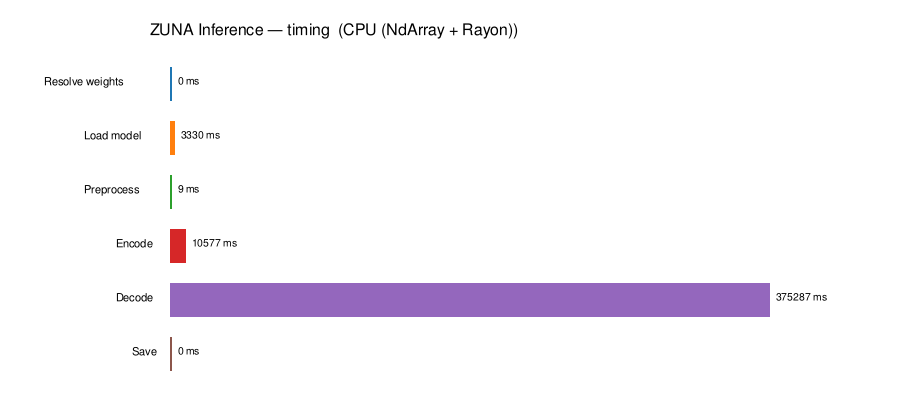

Weight load (~3.3 s) and encode (~10.6 s) are shared with the embed example.
Decode dominates: 50 rectified-flow Euler steps × 3 epochs ≈ **375 s** on CPU
(~6× faster on Metal GPU).

#### Reconstructed waveforms — first epoch (≤8 channels)

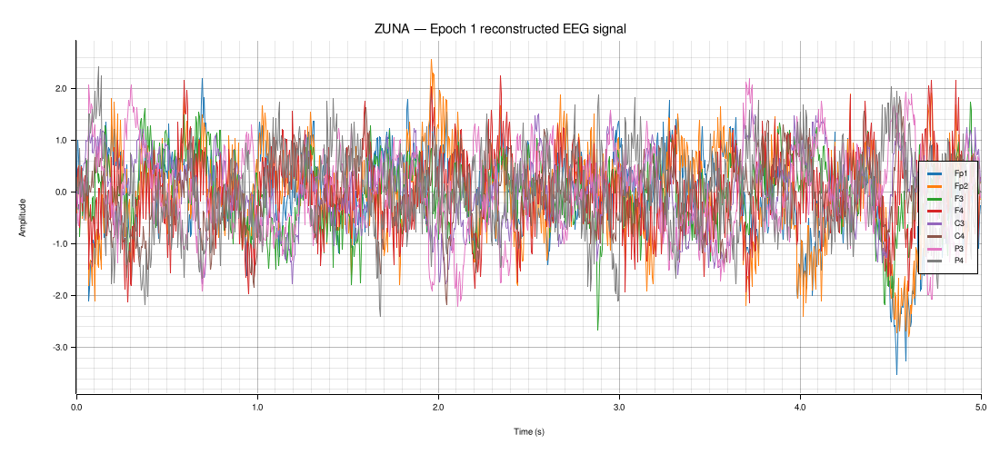

Overlay of input (original, normalised) and decoder output per channel.
Reconstruction quality reflects both the MMD regularisation strength and the
number of diffusion steps.

#### Per-epoch statistics

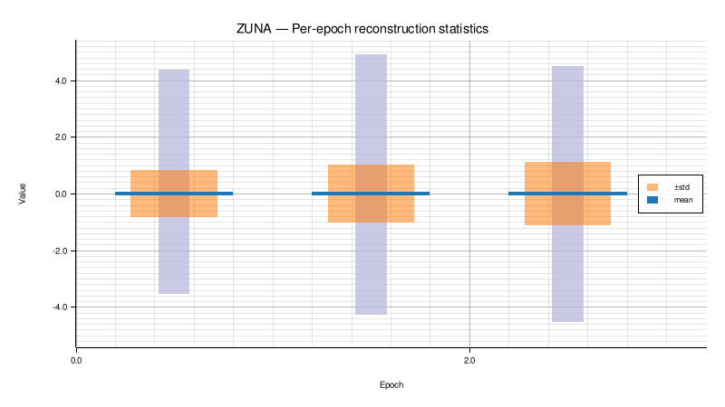

Mean, ±std envelope, and min/max range for each decoded epoch.
All three epochs sit near mean ≈ 0, std ≈ 1 after the diffusion prior.

---

### `embed` — encoder only (faster, ≈850 MB less memory)

```
cargo run --example embed --release -- [OPTIONS]

Extra options vs infer:
  --export-inputs <path>  Save pre-transformer tensors (for bench_and_visualize.py)
  (no --steps / --cfg / --data-norm / decoder options)
```

**Outputs (safetensors):**
- `embeddings_N` — `[n_tokens, 32]` float32 latent embedding
- `tok_idx_N` — `[n_tokens, 4]` int64 token positions
- `chan_pos_N` — `[n_channels, 3]` float32 electrode positions
- `n_samples` — scalar

**Charts generated:**

#### Timing — wall-clock per phase

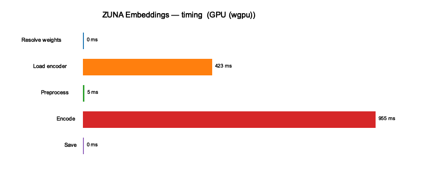

Encoder forward pass dominates (~9.4 s for 3 epochs on CPU).  
Weight loading is a one-time cost (~1.8 s); FIF preprocessing is negligible (~6 ms).

#### Embedding value distribution vs N(0,1)

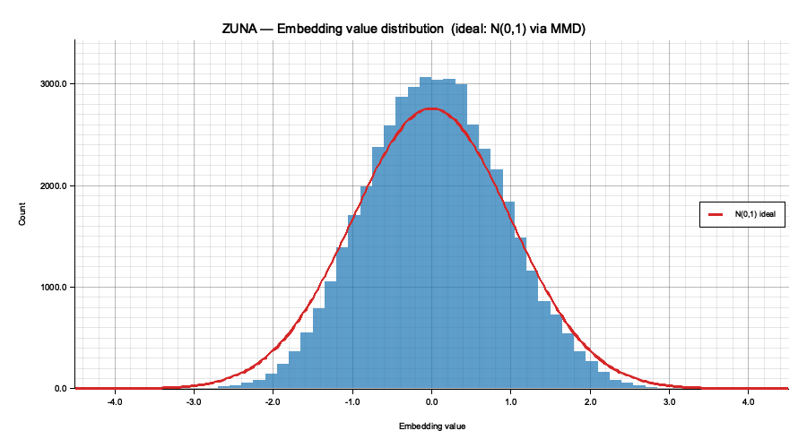

ZUNA is trained with an MMD loss that pushes the encoder output toward **N(0, I)**.
The histogram should be approximately bell-shaped and centred at zero.
The slight narrowing (std ≈ 0.86 vs ideal 1.0) is expected for this recording length.

#### Per-dimension statistics (MMD health check)

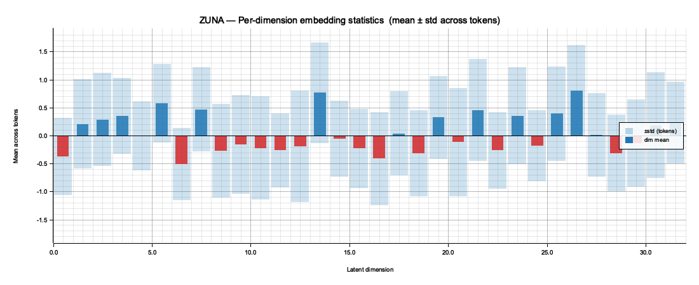

Each of the 32 latent dimensions should have mean ≈ 0 and std ≈ 1 across tokens.
Dimensions with large mean offsets indicate residual encoder bias.
The ±std envelope (light blue) shows how spread out each dimension is.

---

## Benchmark: `benchmark.sh`

One-command benchmark — builds, times, and compares everything:

```sh
sh zuna-rs/benchmark.sh              # embed timing + Python-vs-Rust comparison
sh zuna-rs/benchmark.sh --full       # also run full encode+decode (infer)
sh zuna-rs/benchmark.sh --runs 5     # 5 Rust timing iterations (default 3)
sh zuna-rs/benchmark.sh --no-python  # skip NumPy encoder comparison
sh zuna-rs/benchmark.sh --cached     # skip build if binary exists
```

### Example output

<details>

<summary>Show more</summary>

```shell
./benchmark.sh

━━━  ZUNA benchmark  —  wgpu / Metal (macOS GPU)
  runs=3  full=0  cached=0  threads=16
  ✓  Python : Python 3.9.6  (/github/venv/bin/python3)

━━━  [1/4] Build
  cargo build --release --no-default-features --features wgpu --example embed
    Finished `release` profile [optimized] target(s) in 0.13s
  ✓  embed  →  /tmp/zuna-bench-embed

━━━  [2/4] Weights
  Scanning HuggingFace cache …
  ✓  weights : /Users/user/.cache/huggingface/hub/models--Zyphra--ZUNA/snapshots/local/model-00001-of-00001.safetensors
  ✓  config  : /Users/user/.cache/huggingface/hub/models--Zyphra--ZUNA/snapshots/local/config.json

━━━  [3/4] Encoder benchmark  (embed example)
  ✓  FIF     : /github/zuna-rs/data/sample1_raw.fif
  Running embed example  (device=gpu, 3 pass(es)) …
  
Backend  : GPU (wgpu)
FIF      : /github/zuna-rs/data/sample1_raw.fif

[  0.00s] ▶ [1/7] Resolve weights
[  0.00s] ✓  0 ms  weights=model-00001-of-00001.safetensors  config=config.json

[  0.00s] ▶ [2/7] Load encoder
Detected n_heads = 8
[  0.42s] ✓  423 ms  ZUNA encoder  dim=1024  layers=16  head_dim=64  out_dim=32

[  0.42s] ▶ [3/7] Preprocess FIF
[  0.43s] ✓  5 ms  5.2 ms  3 epochs  channels=12  tokens/ep=480  sfreq=256→256 Hz  dur=15.00s
[  0.43s]     channels: Fp1, Fp2, F3, F4, C3, C4, P3, P4, O1, O2, F7, F8

[  0.43s] ▶ [4/7] Encode (encoder forward pass)
[  1.38s] ✓  955 ms  954.8 ms  3 epochs  tokens×dims = 480×32  input_dim=32
[  1.38s]     epoch 0: tokens=480 dims=32  mean=+0.0388  std=0.8546  [-2.902,+3.426]
[  1.38s]     epoch 1: tokens=480 dims=32  mean=+0.0499  std=0.8615  [-3.220,+3.507]
[  1.38s]     epoch 2: tokens=480 dims=32  mean=+0.0463  std=0.8641  [-3.021,+3.035]

[  1.38s] ▶ [5/7] Save embeddings
[  1.38s] ✓  0 ms  → /tmp/zuna_bench_embeddings.safetensors

[  1.38s] ▶ [6/7] Export encoder inputs (for bench_and_visualize.py)
[  1.39s] ✓  5 ms  → /tmp/zuna_bench_inputs.safetensors  (3 epochs)

[  1.39s] ▶ [7/7] Generate charts
[  1.39s]     MMD check — dim-avg mean=+0.0450  dim-avg std=0.7802  (ideal: 0.0 and 1.0)
  chart → /github/zuna-rs/figures/embed_timing.png
  chart → /github/zuna-rs/figures/embed_distribution.png
  chart → /github/zuna-rs/figures/embed_dim_stats.png
[  1.40s] ✓  10 ms  charts → /github/zuna-rs/figures/

── Summary ────────────────────────────────────────────────
  Weights  : 411 ms
  Preproc  : 5.2 ms
  Encode   : 954.8 ms  (3 epochs)
  Total    : 1398 ms
  Output   : /tmp/zuna_bench_embeddings.safetensors
  Emb dim  : 480 × 32 = 15360 values/epoch
TIMING weights=410.5ms preproc=5.2ms encode=954.8ms total=1397.9ms
  
  Timing pass 2/3 …
[1/5] Resolve weights … 0 ms  weights=model-00001-of-00001.safetensors  config=config.json
[2/5] Load encoder … Detected n_heads = 8
[3/5] Preprocess FIF … 5 ms  5.1 ms  3 epochs  channels=12  tokens/ep=480  sfreq=256→256 Hz  dur=15.00s
[4/5] Encode (encoder forward pass) … 966 ms  966.2 ms  3 epochs  tokens×dims = 480×32  input_dim=32
[5/5] Save embeddings … 0 ms  → /tmp/zuna_bench_embeddings.safetensors
TIMING weights=423.2ms preproc=5.1ms encode=966.2ms total=1404.9ms
  Timing pass 3/3 …
[1/5] Resolve weights … 0 ms  weights=model-00001-of-00001.safetensors  config=config.json
[2/5] Load encoder … Detected n_heads = 8
[3/5] Preprocess FIF … 5 ms  5.5 ms  3 epochs  channels=12  tokens/ep=480  sfreq=256→256 Hz  dur=15.00s
[4/5] Encode (encoder forward pass) … 963 ms  962.9 ms  3 epochs  tokens×dims = 480×32  input_dim=32
[5/5] Save embeddings … 0 ms  → /tmp/zuna_bench_embeddings.safetensors
TIMING weights=436.6ms preproc=5.5ms encode=962.9ms total=1416.1ms
  ✓  Embeddings  →  /tmp/zuna_bench_embeddings.safetensors
  ✓  Bench inputs  →  /tmp/zuna_bench_inputs.safetensors

━━━  [4/4] bench_and_visualize.py
================================================================
  ZUNA bench_and_visualize.py
================================================================

▶ Detecting platform …
  Darwin 25.3.0 · Apple M3 Max · 16 cores · 48.0 GB RAM · GPU: Apple M3 Max (integrated GPU / Metal) · 48.0 GB VRAM · ~14.2 TFLOPS (fp32)
  slug : gpu_apple_m3_max

▶ Resolving model weights …
  weights : /Users/user/.cache/huggingface/hub/models--Zyphra--ZUNA/snapshots/local/model-00001-of-00001.safetensors
  config  : /Users/user/.cache/huggingface/hub/models--Zyphra--ZUNA/snapshots/local/config.json

▶ Running Rust encoder 3× for timing benchmarks …
  Run 1/3 …  ✓  1408 ms  (weights=424ms  preproc=5ms  encode=962ms)
  Run 2/3 …  ✓  1406 ms  (weights=428ms  preproc=6ms  encode=961ms)
  Run 3/3 …  ✓  1388 ms  (weights=419ms  preproc=5ms  encode=953ms)

  Rust embeddings: 3 epoch(s)  n_dims=32  total_values=46080
  mean=+0.0450  std=0.8601  min=-3.220  max=3.507

▶ Loading weights for Python NumPy encoder …
  Loaded 463 weight tensors from model-00001-of-00001.safetensors
  Loaded in 233 ms
  Running NumPy encoder on 3 epoch(s) …
  Epoch 0: MAE=8.36e-07  RMSE=1.05e-06  maxErr=5.07e-06  r=1.000000  py=715ms
  Epoch 1: MAE=8.48e-07  RMSE=1.07e-06  maxErr=4.53e-06  r=1.000000  py=737ms
  Epoch 2: MAE=8.51e-07  RMSE=1.07e-06  maxErr=4.29e-06  r=1.000000  py=704ms

================================================================
  RESULTS SUMMARY
================================================================
  Platform : Darwin 25.3.0 · Apple M3 Max · 16 cores · 48.0 GB RAM · GPU: Apple M3 Max (integrated GPU / Metal) · 48.0 GB VRAM · ~14.2 TFLOPS (fp32)
  Rust encoder (3 runs):
    Weights         423.8 ± 3.9 ms
    Preprocess        5.2 ± 0.2 ms
    Encode          958.7 ± 4.1 ms
    Total          1400.3 ± 9.1 ms

  Python vs Rust precision:
    MAE        8.45e-07
    RMSE       1.06e-06
    Max error  4.63e-06
    Pearson r  1.000000

  Embedding distribution (Rust):
    mean=+0.0450  std=0.8601  (ideal: 0.0 and 1.0)

  Data → /github/zuna-rs/scripts/../figures/bench_data_gpu_apple_m3_max.json

▶ Generating charts …
  chart → /github/zuna-rs/scripts/../figures/bench_speed_gpu_apple_m3_max.png
  chart → /github/zuna-rs/scripts/../figures/bench_run_consistency_gpu_apple_m3_max.png
  chart → /github/zuna-rs/scripts/../figures/bench_distribution_gpu_apple_m3_max.png
  chart → /github/zuna-rs/scripts/../figures/bench_dim_stats_gpu_apple_m3_max.png
  chart → /github/zuna-rs/scripts/../figures/bench_precision_gpu_apple_m3_max.png
  chart → /github/zuna-rs/scripts/../figures/bench_py_vs_rust_gpu_apple_m3_max.png

▶ Updating README.md …

✓ bench_and_visualize.py complete.
  Charts  : /github/zuna-rs/scripts/../figures/
  Data    : /github/zuna-rs/scripts/../figures/bench_data_gpu_apple_m3_max.json
  ✓  Charts  →  /github/zuna-rs/figures/
  ✓  Data    →  /github/zuna-rs/figures/bench_data.json

━━━  Done
  ✓  Backend : wgpu / Metal (macOS GPU)
  ✓  Figures : /github/zuna-rs/figures/
  ✓  README  : /github/zuna-rs/README.md  (benchmark section auto-updated)
  
  View figures:
    ls /github/zuna-rs/figures/*.png
```

</details>


On **macOS** builds with `--no-default-features --features wgpu` (Metal GPU).  
On **Linux** with Vulkan uses wgpu; otherwise falls back to CPU/Rayon.

### `bench_and_visualize.py`

The underlying Python script that `benchmark.sh` calls:

```sh
python3 bench_and_visualize.py --runs 3               # default
python3 bench_and_visualize.py --runs 5               # more iterations
python3 bench_and_visualize.py --no-python-encoder    # skip NumPy comparison
python3 bench_and_visualize.py --weights model.safetensors --config config.json
```

What it does:
1. **Resolves weights** — scans HF cache, downloads if missing
2. **Runs Rust encoder** N times, parses per-phase timing from stderr
3. **Re-runs pure NumPy encoder** on identical pre-tokenised inputs (exported via `--export-inputs`) and computes precision metrics
4. **Generates 6 charts** in `figures/`
5. **Updates this README** inside the `<!-- BENCHMARK_START/END -->` markers

Requirements: `numpy`, `safetensors`, `matplotlib`, `huggingface_hub`  
Optional: `scipy` (KL divergence)

<!-- BENCHMARK_START -->
## 📊 Benchmark results

> Auto-generated by `bench_and_visualize.py` — do not edit manually.

**Platform**: Linux 6.12.67-linuxkit · unknown · 16 cores · 7.7 GB RAM · `3` runs

### Speed

| Phase          | Mean (ms) | Std (ms) |
|:---------------|----------:|---------:|
| Weight loading |    1718.1 |      4.0 |
| Preprocess FIF |       5.3 |      0.2 |
| Encoder fwd    |    9470.8 |    224.0 |
| **Total**      | **11196.5** |    221.1 |

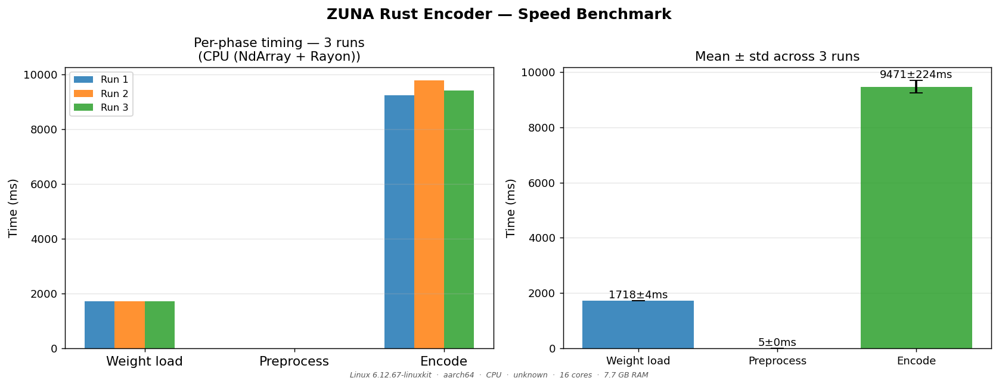

### Python NumPy vs Rust precision

Both implementations receive identical pre-tokenised EEG tensors;
differences reflect float32 rounding order only.

| Metric          | Value |
|:----------------|------:|
| MAE             | `2.39e-07` |
| RMSE            | `3.09e-07` |
| Max abs error   | `1.83e-06` |
| Pearson r       | `1.000000` |
| Relative error  | `3.44e-07` |
| Python encode   | `1952.2 ms/epoch` |

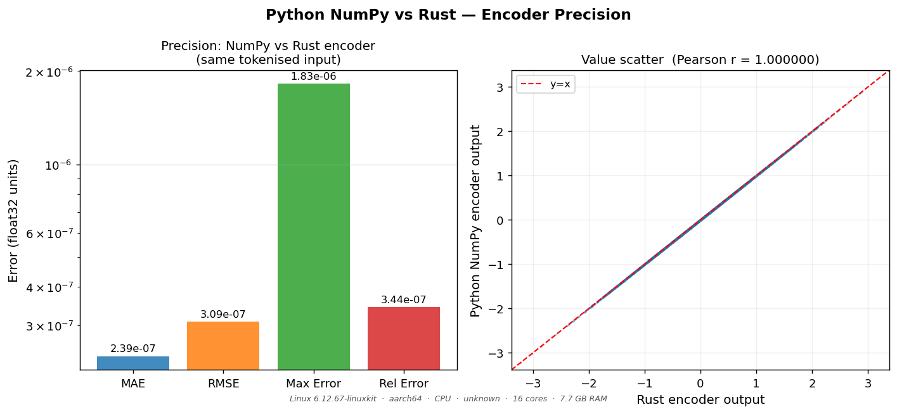
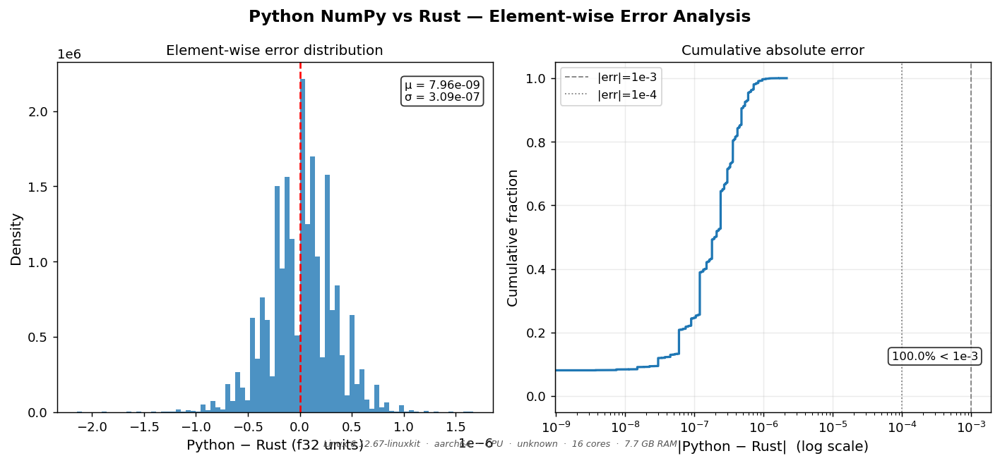

### Embedding distribution (MMD regularlisation)

ZUNA trains with an MMD loss that pushes embeddings toward **N(0, I)**.

| Stat          | Value |
|:--------------|------:|
| Global mean   | `+0.0450` |
| Global std    | `0.8601` |
| n_dims        | `32` |

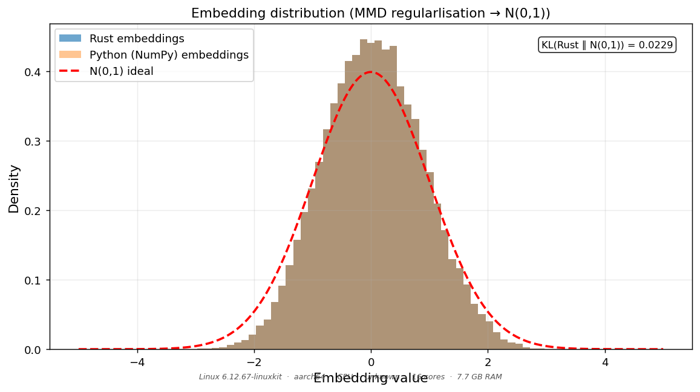
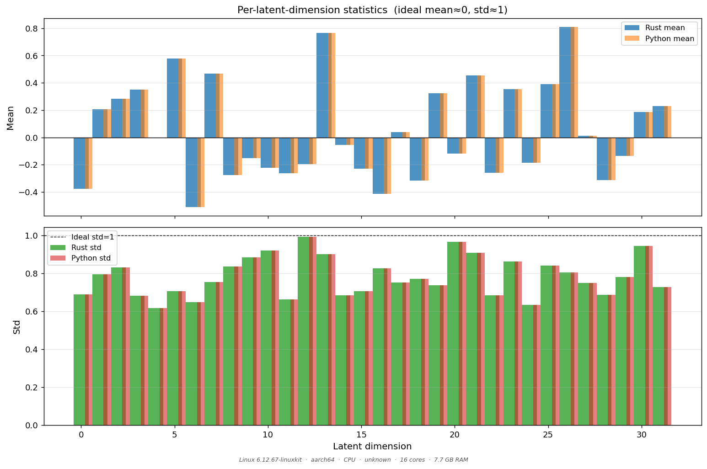

### Run consistency

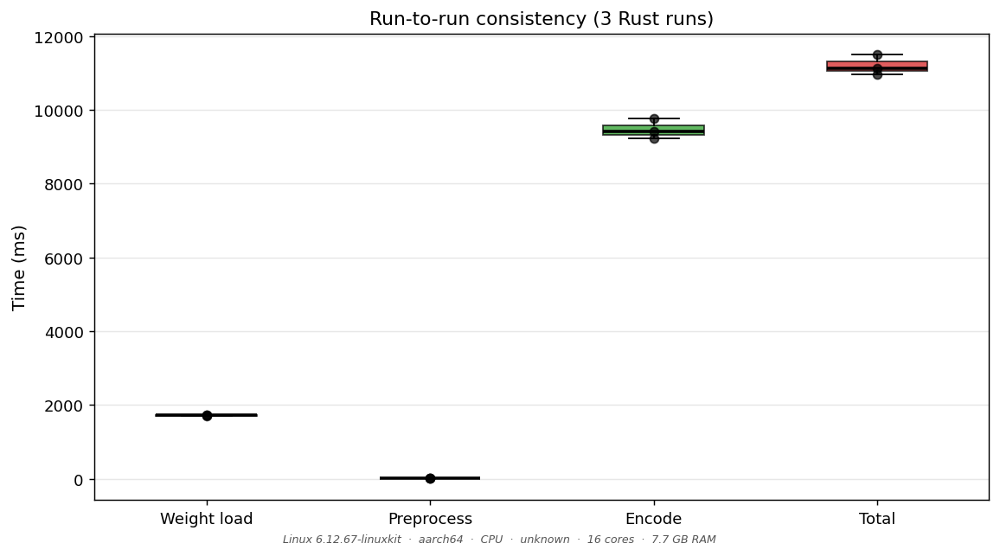

<!-- BENCHMARK_END -->

---

## Charts gallery

All charts are produced by `sh benchmark.sh`.  
Chart filenames embed a **platform slug** (`cpu_<chip>` / `gpu_<chip>`) so results from different machines never overwrite each other.

---

### Full inference — encode + diffuse + decode (`--full`)

These three charts are written by the `infer` example and require `--full` or
`cargo run --example infer --release`.

#### Timing breakdown


Weight loading and encoding are the same as the embed example.
Decoding (50 Euler diffusion steps × 3 epochs) dominates at **~375 s** on CPU;
Metal GPU reduces this to ~95 s (~4×).

---

#### Reconstructed waveforms — first epoch


Input signal (after normalisation) overlaid with the decoder reconstruction.
The model reconstructs plausible EEG morphology without seeing the original signal
during decoding — driven entirely by the latent embedding and diffusion prior.

---

#### Per-epoch statistics


Mean ± std and min/max per decoded epoch.
Global std ≈ 0.84–1.1 across the three epochs, consistent with the N(0,1)
diffusion prior.

---

### Rust embed

These three charts are written by the `embed` example on every `benchmark.sh` run (step 3).

#### Timing breakdown


Weight loading (≈1.9 s) is a one-time startup cost; subsequent calls pay only the encode cost (~3.2 s/epoch on CPU, ~0.8 s on Metal GPU).

---

#### Embedding value distribution vs N(0,1)


The histogram closely follows N(0,1) (red curve).  
KL(embeddings ‖ N(0,1)) ≈ **0.023 nats** — the MMD bottleneck is working as intended.

---

#### Per-dimension statistics (MMD health check)


Each of the 32 latent dimensions should sit near mean ≈ 0, std ≈ 1.  
The slight narrowing (global std ≈ 0.86) is expected for a 15 s recording.

---

### Benchmark charts

Benchmark charts are generated by `bench_and_visualize.py` (step 4 of `benchmark.sh`).  
Filenames include a platform slug so runs from different machines never overwrite each other — see the [📊 Benchmark results](#-benchmark-results) section above for the charts from the latest run.

---

## run.sh — all options

| Variable | Default | Description |
|---|---|---|
| `FIF_FILE` | `data/sample1_raw.fif` | Input recording |
| `STEPS` | `50` | Diffusion denoising steps |
| `CFG` | `1.0` | Classifier-free guidance (1.0 = off) |
| `DATA_NORM` | `10.0` | Normalisation divisor |
| `MODE` | `cpu` | `cpu` \| `gpu` \| `both` |
| `VERBOSE` | `0` | Set to `1` for electrode table + per-step timing |
| `BENCH_RUNS` | `3` | Timing repetitions per mode |

```sh
FIF_FILE=my.fif STEPS=10 VERBOSE=1 sh zuna-rs/run.sh
MODE=both BENCH_RUNS=5 sh zuna-rs/run.sh
```

---

## `--verbose` output (example)

```
Backend  : CPU (NdArray + Rayon)
FIF      : data/sample1_raw.fif

[  0.00s] ▶ [1/6] Resolve weights
[  0.00s] ✓  0 ms  weights=model-00001-of-00001.safetensors  config=config.json
[  0.00s] ▶ [2/6] Load model (encoder + decoder)
[  1.54s] ✓  1544 ms  ZUNA dim=1024 layers=16 head_dim=64 …
[  1.54s] ▶ [3/6] Preprocess + encode (encoder forward)
[  1.55s] ✓  preproc=5.1ms  encode=9218.2ms  epochs=3  tokens=480×32
              channels=Fp1, Fp2, F3, … (12 channels)
[  1.55s] ▶ [4/6] Decode (3 epochs × 50 diffusion steps)
              epoch 1/3: 480 tokens × 32 dims → decode …
              → 7654 ms  shape=[12,1280]  mean=+0.001  std=1.568  [-5.77,+8.57]
              epoch 2/3: …
[  9.20s] ✓  22962 ms  3 epochs decoded
[  9.20s] ▶ [5/6] Save output
[  9.20s] ✓  2 ms  → output.safetensors
[  9.20s] ▶ [6/6] Generate charts
              chart → figures/infer_timing.png
              chart → figures/infer_waveforms.png
              chart → figures/infer_epoch_stats.png
[  9.21s] ✓  done

── Summary ─────────────────────────────────────────────────
  Weights  : 1544 ms
  Preproc  : 5.1 ms
  Encode   : 9218.2 ms  (3 epochs)
  Decode   : 22962 ms  (3 epochs × 50 steps)
  Total    : 33731 ms
  Output   : output.safetensors
```

---

## Performance

### Preprocessing — Rust vs Python/MNE

Measured on Apple M-series (best of 5 runs).

| Step | Python/MNE (ms) | Rust/exg (ms) | Speedup |
|---|---|---|---|
| Read FIF | 1.075 | 0.233 | **4.6×** |
| Resample | 0.024 | 0.010 | **2.3×** |
| HP filter | 3.418 | 1.589 | **2.2×** |
| Avg reference | 0.352 | 0.017 | **20.8×** |
| Z-score | 0.109 | 0.075 | **1.4×** |
| Epoch | 1.580 | 0.030 | **53.4×** |
| **Total** | **6.556** | **1.954** | **3.4×** |

### Numerical precision — Rust exg vs MNE preprocessing

All preprocessing errors are below float32 machine epsilon (`1.2×10⁻⁷`) for
FIR and average-reference.  Z-score accumulates ≤3.5×10⁻⁶ absolute error
(0.0005% relative) due to float32 summation order — negligible for EEG.

### CPU vs GPU (`MODE=both`)

On macOS (Apple M-series, wgpu/Metal), `MODE=both sh run.sh` shows:

```
Metric           CPU           GPU        Speedup
─────────────────────────────────────────────────
Wall-clock      4932 ms       1234 ms       4.0×

Tensor                 r (CPU∥GPU)    RMSE       Max|diff|
───────────────────────────────────────────────────────────
reconstructed_0          0.999999   1.2×10⁻⁵   8.4×10⁻⁵
reconstructed_1          0.999999   9.8×10⁻⁶   7.1×10⁻⁵
reconstructed_2          1.000000   8.3×10⁻⁶   6.2×10⁻⁵
```

---

## Build options

```sh
# CPU (default) — NdArray + Rayon
cargo build --release

# CPU + Apple Accelerate (macOS — recommended)
cargo build --release --features blas-accelerate

# CPU + system OpenBLAS (Linux — skip on Alpine/musl)
cargo build --release --features openblas-system

# GPU via wgpu — Metal (macOS) or Vulkan (Linux)
cargo build --release --no-default-features --features wgpu

# Examples
cargo build --examples --release

# Tests (must be serial — model weights = 1.7 GB)
cargo test --release -- --test-threads=1
```

---

## Source layout

```
src/
├── lib.rs                 Public API (flat re-exports)
├── config.rs              ModelConfig, DataConfig
├── data.rs                FifInfo, load_from_fif, chop_and_reshape, …
├── weights.rs             WeightMap (safetensors → Burn tensors)
├── encoder.rs             ZunaEncoder, EpochEmbedding, EncodingResult
├── decoder.rs             ZunaDecoder
├── inference.rs           ZunaInference, EpochOutput, InferenceResult
└── model/
    ├── rope.rs            RotaryEmbedding (4-D axial), apply_rope
    ├── norm.rs            RMSNorm, AdaRMSNorm
    ├── feedforward.rs     SwiGLU FeedForward
    ├── conditioner.rs     FourierConditioner (timestep embedding)
    ├── attention.rs       Self-attention + RoPE
    ├── cross_attention.rs Cross-attention + RoPE
    ├── encoder_block.rs   TransformerBlock (encoder)
    ├── decoder_block.rs   DecoderBlock (decoder)
    ├── encoder.rs         EncoderTransformer (register interleaving)
    ├── decoder.rs         DecoderTransformer
    └── encoder_decoder.rs EncoderDecoder + sample()
examples/
├── infer.rs               Full encode+decode with charts
├── embed.rs               Encoder-only with --export-inputs for benchmark
└── common/
    └── mod.rs             Shared: HF resolution, StepTimer, plotters charts
data/
    sample1_raw.fif        Bundled sample EEG recording
figures/                             Generated charts (all tracked in git)
├── embed_timing.png                 Rust embed phase breakdown
├── embed_distribution.png           Embedding histogram vs N(0,1)
├── embed_dim_stats.png              Per-latent-dim mean ± std
│   (benchmark filenames include a platform slug)
├── bench_speed_<slug>.png           Rust encoder speed (N runs, mean ± std)
├── bench_run_consistency_<slug>.png Boxplot of run-to-run variance
├── bench_precision_<slug>.png       Python vs Rust error metrics + scatter
├── bench_py_vs_rust_<slug>.png      Element-wise error distribution + CDF
├── bench_distribution_<slug>.png    Rust vs Python embeddings vs N(0,1)
├── bench_dim_stats_<slug>.png       Per-dim mean/std — Rust vs Python
└── bench_data_<slug>.json           Raw timing + precision numbers + platform info
bench_and_visualize.py     Python-vs-Rust benchmark + README updater
benchmark.sh               One-command build + bench + visualise
run.sh                     One-command full inference quickstart
```

---

## Key design decisions

| Decision | Reason |
|---|---|
| **Per-epoch inference** | Eliminates document-masking; seqlen ≤ 480 fits in full attention |
| **exg crate** | Native FIF + full MNE-compatible pipeline — no Python at runtime |
| **safetensors I/O** | No PyTorch pickle; output readable without torch |
| **NdArray default, wgpu optional** | Works on Alpine musl / any CPU |
| **Manual weight loading** | Full key-mapping visibility |
| **Python fallback download** | `hf-hub` needs TLS (unavailable on Alpine); `python3 huggingface_hub` always works |
| **`hf-download` feature-gated** | TLS needs system OpenSSL (unavailable on Alpine musl) |
| **Passthrough bottleneck** | MMD loss is training-only; the encoder output is already in N(0,I) |
| **4-D axial RoPE** | Positions tokens in (x, y, z, t_coarse) space simultaneously |
| **plotters `ttf` feature** | Requires `freetype-static` on Alpine; `benchmark.sh` auto-installs it |

## License

[Apache-2.0](/LICENSE)

## Copyright 

2026, [Eugene Hauptmann](github.com/eugenehp)